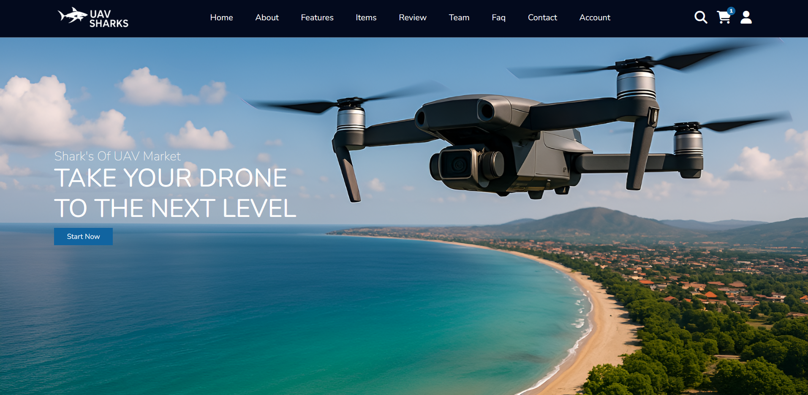

# UAV Shark's – Drone Parts Store Website Template

UAV Shark's is a fully responsive and interactive single-page website template designed for a modern drone parts store.

  

## Overview

This project provides a sleek, visually appealing website that highlights your products, team, customer reviews, and more. The design is fully responsive, ensuring compatibility across various devices, from desktop to mobile. It incorporates smooth animations, dynamic content toggling, and interactive elements to engage users and streamline navigation.

## Key Features

- **Fixed Header & Navigation:**  
  A modern, fixed header that remains at the top of the page. The navigation bar includes links to all main sections: Home, About, Features, Items, Review, Team, FAQ, Contact, and Account. A mobile-friendly menu icon toggles the navbar on smaller screens.

- **Interactive Search:**  
  A toggleable search form allows users to quickly search for products on the site. The search functionality dynamically filters product items as the user types.

- **Dynamic Shopping Cart:**  
  Users can add items to a shopping cart with a smooth "shake" animation effect. The cart updates in real time, showing the number of items added, and allows for item removal.

- **User Account Management:**  
  A built-in user account section provides separate forms for registration and login. Upon successful submission, a welcome message is displayed with a logout option, simulating a basic authentication experience.

- **Responsive Product Showcase:**  
  The items section displays products with images, names, prices (including discount information), and an "add to cart" button, all styled for visual clarity.

- **Customer Reviews & Ratings:**  
  A dedicated section highlights customer testimonials with star ratings, quotes, and user images to build trust and credibility.

- **Team Introduction:**  
  Showcases team members along with their roles and social media links, providing a personal touch and highlighting the expertise behind the brand.

- **FAQ Section:**  
  An interactive FAQ section where each question expands to reveal its answer when clicked, helping users find relevant information quickly.

- **Contact Form & Newsletter Subscription:**  
  - **Contact:** An easy-to-use form lets customers send inquiries directly.  
  - **Newsletter:** A subscription form allows users to sign up for updates, complete with basic email validation.

- **Back-to-Top Button:**  
  A convenient button appears after scrolling down the page, enabling smooth navigation back to the top.

## Technical Details

### HTML Structure
- **Semantic Markup:** Uses HTML5 semantic elements for improved accessibility and SEO.
- **Sectioned Layout:** Divided into distinct sections (Home, About, Features, etc.) for better organization and navigation.

### CSS Styling
- **Responsive Design:** Media queries adjust layout and typography for different screen sizes.
- **Custom Properties:** Utilizes CSS variables for consistent color themes and easy customization.
- **Animations:** Includes subtle animations (e.g., shake and pop effects) to enhance user interaction and feedback.

